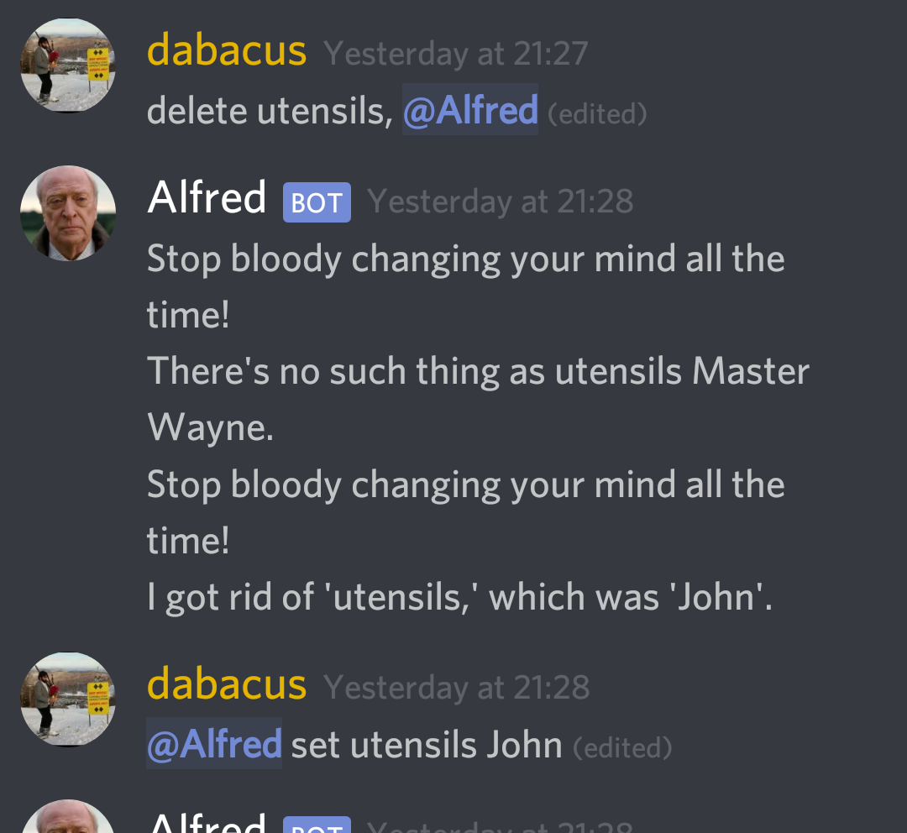

# discord-alfred
A butler to keep track of who is responsible for what in the apartment

## Installation
 * Install dependencies with `npm install`.
 * Change the `id` and set the `token` in `config.json` to correspond to your discord bot's credentials.
 * Run it with `./run.sh`.

## Features
 * Alfred will keep a single central key,val map that anyone in the discord server can modify with the commands `get`, `set`, and `delete`.
 * Use the special key `all` to get or delete all keys in the map.
 * allows for very loose style of sending commands to Alfred (all that matters is the 2-3 words for the command are the first words in the sentence with @Alfred thrown anywhere in the sentence)

## Usage
 * get: `@Alfred get <key>` or `@Alfred get all`
 * set: `@Alfred set <key> <val>` to both create or update a key
 * delete: `@Alfred delete <key>` or `@Alfred delete all`
 * use quotation marks: `"` to delimit keys or values with spaces in them

## Examples
 * get: `get "some key" for me, would you @Alfred`
 * set: `@Alfred set "some key" VaLuE and any words I put here don't matter`
 * delete: `delete all @Alfred please`

